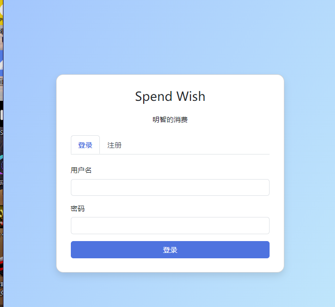
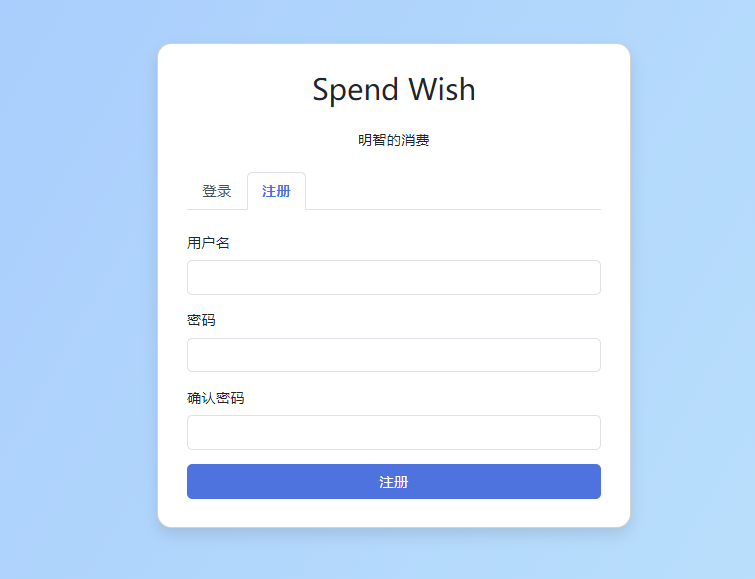
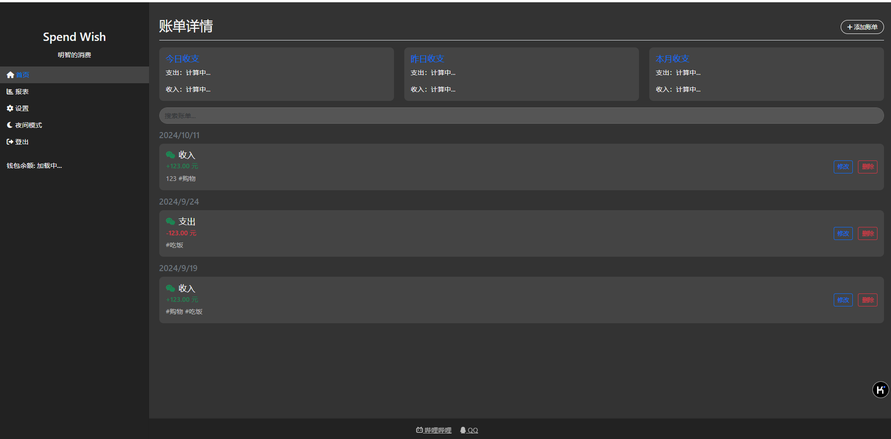
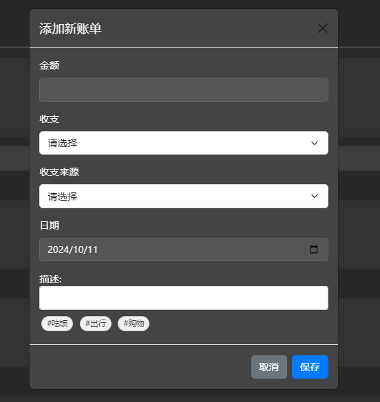

# Spend Wish（明智的消费）项目技术文档

## 目录
1. [技术栈](#技术栈)
2. [后端 API 接口](#后端-api-接口)
3. [使用示例](#使用示例)

## 技术栈

### 前端
- HTML5
- CSS3
- JavaScript (ES6+)
- Bootstrap 5
- jQuery
- Chart.js (用于数据可视化)

### 后端
- Java
- Spring Boot
- MyBatis
- JWT (JSON Web Tokens) 用于身份验证

### 数据库
- MySQL

###页面截图
##注册登录页面


##主页面

##添加账单功能

## 后端 API 接口

### 用户相关

#### 1. 用户注册
- **URL**: `/users/register`
- **方法**: POST
- **请求体**:
  ```json
  {
    "username": "用户名",
    "password": "密码"
  }
  ```
- **响应**:
  ```json
  {
    "message": "Registration successful"
  }
  ```

#### 2. 用户登录
- **URL**: `/users/login`
- **方法**: POST
- **请求体**:
  ```json
  {
    "username": "用户名",
    "password": "密码"
  }
  ```
- **响应**:
  ```json
  {
    "token": "JWT令牌",
    "message": "Login successful"
  }
  ```

### 账单相关

**注意**：以下所有请求都需要在请求头中包含 JWT 令牌：

#### 1. 获取所有账单
- URL: `/bills/queryall`
- 方法: GET
- 响应: 账单对象数组

#### 2. 添加新账单
- URL: `/bills/add`
- 方法: POST
- 请求体:
  ```json
  {
    "bill_price": 100.00,
    "bill_date": "2023-05-01",
    "bill_type": "out",
    "bill_remark": "购物",
    "bill_user": "用户名"
  }
  ```
- 响应: 无（成功状态码）

#### 3. 删除账单
- URL: `/bills/delete`
- 方法: POST
- 参数: `bill_id=账单ID`
- 响应: 无（成功状态码）

#### 4. 更新账单
- URL: `/bills/update`
- 方法: PUT
- 请求体:
  ```json
  {
    "bill_id": 1,
    "bill_price": 150.00,
    "bill_date": "2023-05-01",
    "bill_type": "out",
    "bill_remark": "购物（已更新）",
    "bill_user": "用户名"
  }
  ```
- 响应: 无（成功状态码）

#### 5. 搜索账单
- URL: `/bills/search`
- 方法: POST
- 请求体:
  ```json
  {
    "term": "搜索关键词"
  }
  ```
- 响应: 匹配的账单对象数组

#### 6. 获取收支统计
- URL: `/bills/expenses`
- 方法: POST
- 响应:
  ```json
  {
    "todayExpense": 100.00,
    "todayIncome": 200.00,
    "yesterdayExpense": 50.00,
    "yesterdayIncome": 150.00,
    "monthExpense": 1000.00,
    "monthIncome": 2000.00
  }
  ```

#### 7. 获取报表数据
- URL: `/bills/report`
- 方法: GET
- 响应: 包含类别报表和趋势报表的对象

#### 8. 获取类别报表
- URL: `/bills/report/category`
- 方法: GET
- 响应: 各类别支出金额的对象

#### 9. 获取趋势报表
- URL: `/bills/report/trend`
- 方法: GET
- 响应: 每日收支趋势的对象
